# LinuxLingo Developer Guide

- [Acknowledgements](#acknowledgements)
- [Setting Up, Getting Started](#setting-up-getting-started)
- [Design](#design)
  - [Architecture](#architecture)
  - [CLI Component](#cli-component)
  - [Shell Component](#shell-component)
  - [Exam Component](#exam-component)
  - [Storage Component](#storage-component)
  - [VFS (Virtual File System) Component](#vfs-virtual-file-system-component)
- [Implementation](#implementation)
  - [Shell Parsing and Execution](#shell-parsing-and-execution)
  - [Command Execution with Piping and Redirection](#command-execution-with-piping-and-redirection)
  - [VFS Environment Persistence](#vfs-environment-persistence)
  - [Exam Session Flow](#exam-session-flow)
  - [Question Parsing and Loading](#question-parsing-and-loading)
  - [Resource Extraction on First Run](#resource-extraction-on-first-run)
- [Appendix A: Product Scope](#appendix-a-product-scope)
- [Appendix B: User Stories](#appendix-b-user-stories)
- [Appendix C: Non-Functional Requirements](#appendix-c-non-functional-requirements)
- [Appendix D: Glossary](#appendix-d-glossary)
- [Appendix E: Instructions for Manual Testing](#appendix-e-instructions-for-manual-testing)

---

## Acknowledgements

- [AddressBook-Level3 (AB3)](https://se-education.org/addressbook-level3/) — Project structure and Developer Guide format adapted from SE-EDU.
- [PlantUML](https://plantuml.com/) — Used for UML diagram generation.
- [Gradle Shadow Plugin](https://github.com/johnrengelman/shadow) — Used for building fat JARs.

---

## Setting Up, Getting Started

Refer to the guide [Development Guide](DevelopmentGuide.md) for the full project structure and module responsibilities.

**Prerequisites:**

1. JDK 17 or above.
2. Gradle 7.x (wrapper included — use `./gradlew`).

**Building the project:**

```shell
./gradlew build
```

**Running the application:**

```shell
./gradlew run
```

**Running tests:**

```shell
./gradlew test
```

---

## Design

### Architecture

The **Architecture Diagram** below gives a high-level overview of LinuxLingo.

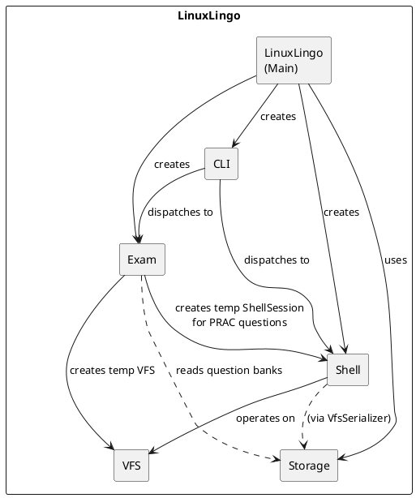

**Main components of the architecture:**

`LinuxLingo` (the main class) is in charge of app launch. At startup, it:

- Extracts bundled question bank resources to disk (via `ResourceExtractor`).
- Loads the `QuestionBank` from `data/questions/`.
- Creates the shared `VirtualFileSystem`, `ShellSession`, and `ExamSession`.
- Delegates to `MainParser` for interactive mode, or handles one-shot CLI commands directly.

The bulk of the app's work is done by the following components:

| Component | Responsibility |
| --------- | -------------- |
| **CLI** | Handles user I/O (`Ui`) and top-level command dispatch (`MainParser`). |
| **Shell** | Parses and executes shell commands in a simulated Linux environment. |
| **Exam** | Manages exam sessions — question presentation, answer checking, scoring. |
| **Storage** | Reads/writes data on the real file system (question banks, VFS snapshots). |
| **VFS** | In-memory virtual file system that all shell commands operate on. |

**How the components interact with each other:**

The following sequence diagram shows the interactions when the user launches the app in interactive mode and types `shell`:

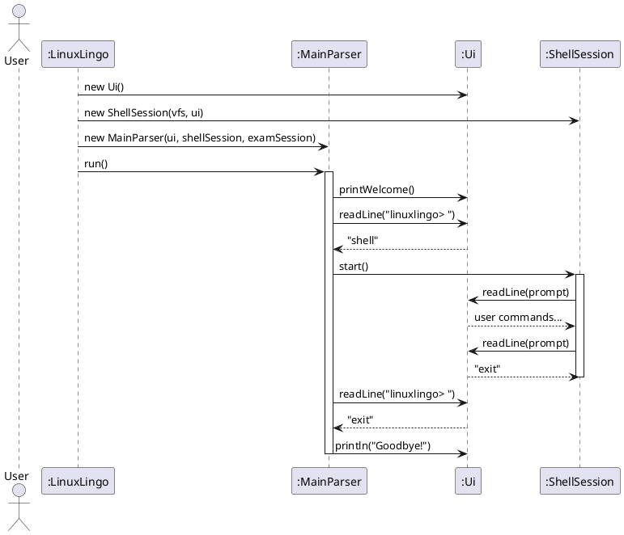

---

### CLI Component

The CLI component consists of two classes: `Ui` and `MainParser`.

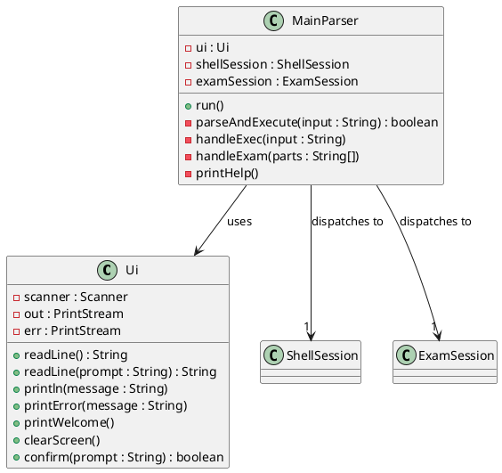

**`Ui`** is the single point of contact for all user-facing I/O. It wraps `Scanner` for input and `PrintStream` for output. All components use `Ui` instead of directly calling `System.in`/`System.out`, making testing easier.

**`MainParser`** implements the top-level REPL loop. It reads user input and dispatches to one of: `shell` (enter Shell Simulator), `exam` (start an exam), `exec` (one-shot shell command), `help`, or `exit`.

---

### Shell Component

The Shell component handles command parsing, execution, and the interactive REPL.

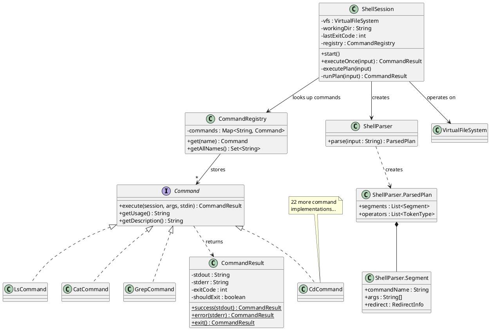

The Shell component:

- Uses `ShellParser` to tokenize and parse raw input into a `ParsedPlan` (a list of `Segment` objects connected by operators).
- `ShellSession` iterates through segments, looking up each command name in `CommandRegistry`, executing them, and chaining results via pipes, `&&`, or `;`.
- Each `Command` implementation receives the current `ShellSession` (for VFS access and session state), parsed arguments, and optional piped stdin. It returns a `CommandResult` containing stdout, stderr, and an exit code.

**Supported commands (26 total):**

| Category | Commands |
| -------- | -------- |
| Navigation | `cd`, `ls`, `pwd` |
| File Operations | `mkdir`, `touch`, `rm`, `cp`, `mv`, `cat`, `echo` |
| Text Processing | `head`, `tail`, `grep`, `find`, `wc`, `sort`, `uniq` |
| Permissions | `chmod` |
| Environment | `save`, `load`, `reset`, `envlist`, `envdelete` |
| Utility | `help`, `clear` |

---

### Exam Component

The Exam component handles question presentation, answer checking, and score tracking.

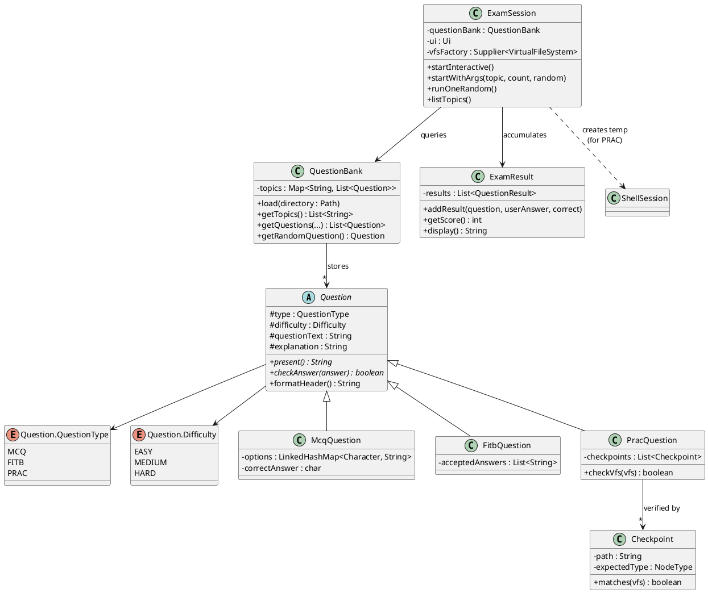

The Exam component:

- `QuestionBank` loads question data files from `data/questions/` (via `QuestionParser`) and organizes them by topic.
- `ExamSession` orchestrates exam sessions with three entry points: interactive mode, direct CLI args, and single-random-question mode.
- Three question types are supported: `McqQuestion` (multiple choice), `FitbQuestion` (fill in the blank), and `PracQuestion` (practical — verified by checking VFS state).
- `ExamResult` tracks per-question outcomes and computes scores.

---

### Storage Component

The Storage component handles all real disk I/O operations.

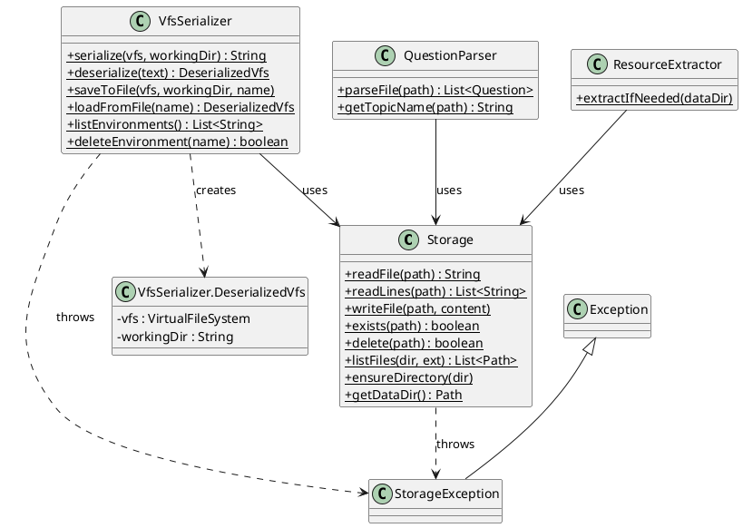

The Storage component:

- `Storage` provides static utility methods for file read/write, directory creation, and path management. All persistent data lives under `data/`.
- `VfsSerializer` converts VFS snapshots to/from a custom `.env` text format, enabling users to save and load shell environments.
- `QuestionParser` parses `.txt` question bank files into `Question` objects using a pipe-delimited format.
- `ResourceExtractor` copies bundled question bank files from the JAR to `data/questions/` on first run.

---

### VFS (Virtual File System) Component

The VFS component provides an in-memory simulated Linux file system.

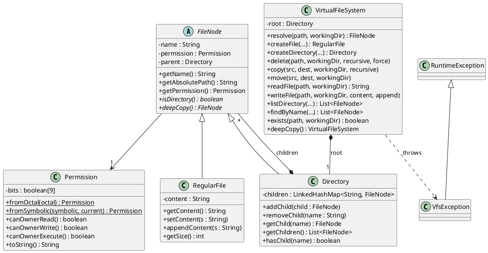

Key design decisions for VFS:

- **All path operations go through `VirtualFileSystem`** — shell commands never use `java.io` or `java.nio.file` for simulated files. This ensures a fully isolated, deterministic simulation.
- The VFS uses a **tree structure** of `FileNode` objects. `Directory` holds a `LinkedHashMap` of children for ordered, O(1) lookup by name.
- **`Permission`** models Unix 9-character permission strings (`rwxr-xr-x`), supporting both octal and symbolic notation for `chmod`.
- **`deepCopy()`** is provided at every level (VFS, Directory, RegularFile) to enable snapshot-based features (e.g., creating a temp VFS for PRAC exam questions).

---

## Implementation

This section describes some noteworthy details on how certain features are implemented.

### Shell Parsing and Execution

The shell parsing pipeline transforms raw user input into a structured execution plan.

**Parsing pipeline overview:**

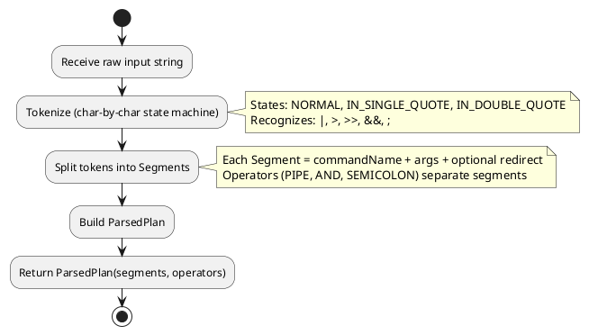

The tokenizer uses a character-by-character state machine with three states:

1. **NORMAL** — accumulates characters into tokens. Whitespace flushes the current token. Special characters (`|`, `>`, `>>`, `&&`, `;`) produce operator tokens. Quote characters switch state.
2. **IN_SINGLE_QUOTE** — all characters are literal until the closing `'`.
3. **IN_DOUBLE_QUOTE** — all characters are literal until the closing `"`.

After tokenization, the token list is split into `Segment` objects at inter-segment operators (`PIPE`, `AND`, `SEMICOLON`). Within each segment, `REDIRECT` / `APPEND` tokens consume the next `WORD` token as the redirect target file.

The parser also handles two lookahead cases during tokenization: `||` and `>>` are
distinguished from `|` and `>` by peeking at the next character before emitting a token.
A lone `&` character (not followed by another `&`) is treated as a literal word character
rather than an operator, matching standard shell behaviour. The `Expecting` state tracks
whether the next WORD token should be consumed as a redirect target (for `>` / `>>`) or
as an input redirect source (for `<`), and resets silently on malformed input such as
a missing filename after a redirect operator.

**Execution engine (`ShellSession.runPlan()`):**

The following sequence diagram shows how `echo hello | grep h > output.txt` is executed:

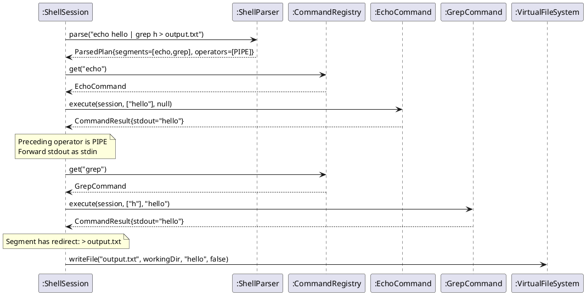

When a command name is not found in the registry, `runPlan()` calls `suggestCommand()`
before printing the error. This method computes the Levenshtein edit distance between
the mistyped input and every registered command name, returning a "Did you mean 'X'?"
hint if the closest match is within distance 2. Glob patterns in arguments (containing
`*` or `?`) are expanded against the VFS via `expandGlobs()` before the command receives
them — if no VFS paths match the pattern, the literal argument is passed through unchanged.

**Operator semantics:**

| Operator | Symbol | Behavior |
| -------- | ------ | -------- |
| `PIPE` | `\|` | stdout of segment N becomes stdin of segment N+1 |
| `AND` | `&&` | Segment N+1 runs only if segment N succeeded (exit code 0) |
| `SEMICOLON` | `;` | Segment N+1 always runs regardless of exit code |

---

### Command Execution with Piping and Redirection

All 26 commands follow the same implementation pattern:

1. Parse flags and arguments from `args[]`.
2. Determine input source: file arguments take priority over piped `stdin`.
3. Call VFS methods on `session.getVfs()`.
4. Catch `VfsException` → return `CommandResult.error("cmdName: " + e.getMessage())`.
5. Return `CommandResult.success(output)`.

The following activity diagram shows the input resolution logic for commands that support both file arguments and piped stdin (e.g., `cat`, `head`, `tail`, `grep`, `sort`, `uniq`, `wc`):

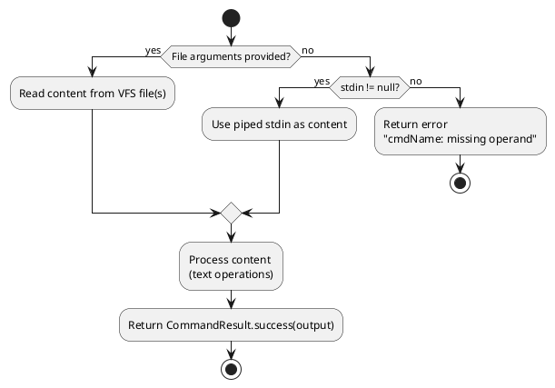

---

### VFS Environment Persistence

Users can save and load VFS snapshots through the `save`, `load`, `reset`, `envlist`, and `envdelete` commands. The `VfsSerializer` handles the conversion.

**Save/Load flow:**

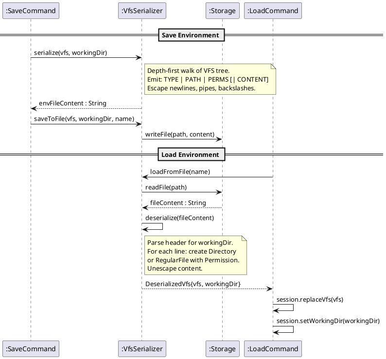

**`.env` file format:**

```text
# LinuxLingo Virtual File System Snapshot
# Saved: 2026-03-27T14:30:00
# Working Directory: /home/user
#
# Format: TYPE | PATH | PERMISSIONS | CONTENT

DIR  | /              | rwxr-xr-x
DIR  | /home          | rwxr-xr-x
FILE | /etc/hostname  | rw-r--r-- | linuxlingo
```

Content escaping rules: `\n` → newline, `\|` → literal pipe, `\\` → literal backslash.

---

### Exam Session Flow

The exam module supports three entry modes and three question types.

**Interactive exam flow:**

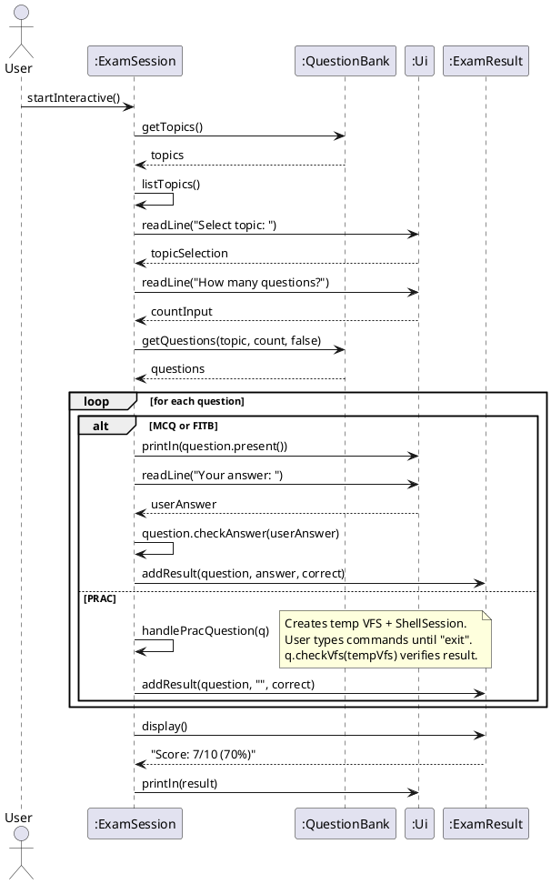

**PRAC question handling:**

For practical questions, `ExamSession.handlePracQuestion()`:

1. Creates a fresh `VirtualFileSystem` via the `vfsFactory` supplier.
2. Creates a temporary `ShellSession` with this VFS.
3. Calls `tempSession.start()` — the user types shell commands.
4. When the user types `exit`, the temporary session ends.
5. Calls `PracQuestion.checkVfs(tempVfs)` which verifies each `Checkpoint` (expected path + node type).

---

### Question Parsing and Loading

Question bank files use a pipe-delimited format. `QuestionParser` processes each line into typed `Question` objects.
The question bank parsing feature is implemented by QuestionParser, which reads plain-text .txt files from the data/questions directory via Storage.readLines(Path) and converts each non-comment, non-blank line into a concrete Question object. 
Each line is pipe-delimited into up to six fields: TYPE | DIFFICULTY | QUESTION_TEXT | ANSWER | OPTIONS | EXPLANATION. 
QuestionParser normalises the type and difficulty (defaulting invalid difficulty values to MEDIUM), then dispatches to parseMcq, parseFitb, or parsePrac based on the TYPE field.
MCQ options are parsed into a LinkedHashMap<Character, String> to preserve display order, FITB answers are split on unescaped | (with \| treated as a literal pipe), and PRAC answers are currently parsed into simple Checkpoint objects, with a v2.0 hook for optional setup items. 
Malformed lines are skipped with a logged warning instead of failing the entire file, and an assertion ensures that the resulting question list contains no null entries. 
We chose a pipe-separated text format instead of JSON/YAML to keep the files compact, easy to edit, and diff-friendly for contributors. 
Alternatives such as embedding questions directly in Java code or using a more complex DSL were rejected because they would make non-developer contributions harder and tightly couple content with implementation; 
the current design keeps parsing logic centralized in QuestionParser and lets the rest of the exam module work purely with typed Question objects.
**Data flow:**

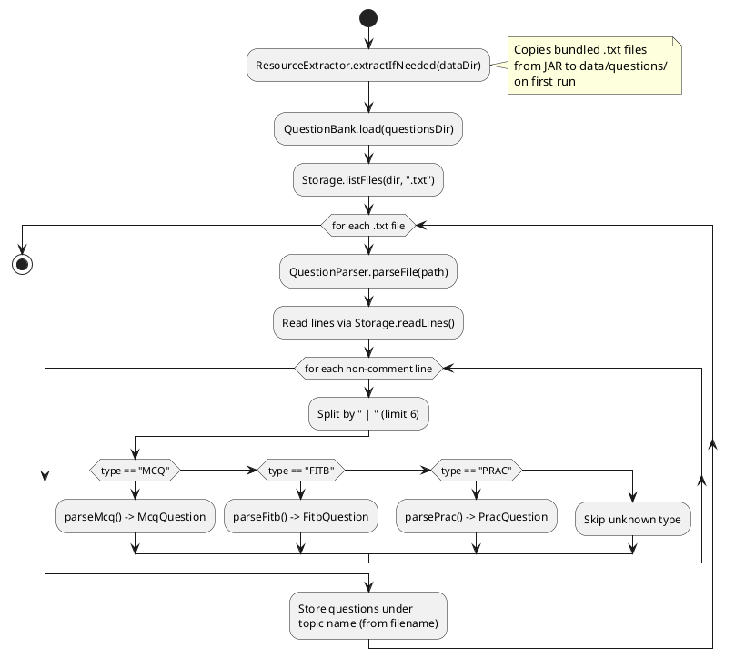

**Question bank line format:**

```text
TYPE | DIFFICULTY | QUESTION_TEXT | ANSWER | OPTIONS | EXPLANATION
```

- **MCQ** answer: single letter (e.g., `B`). Options: `A:text B:text C:text D:text`.
- **FITB** answer: accepted answers separated by `|` (e.g., `pwd|PWD`).
- **PRAC** answer: checkpoints as `path:TYPE` pairs (e.g., `/home/project:DIR,/home/project/readme.txt:FILE`).

---

### Resource Extraction on First Run

`ResourceExtractor` ensures that bundled question bank files are available on disk.

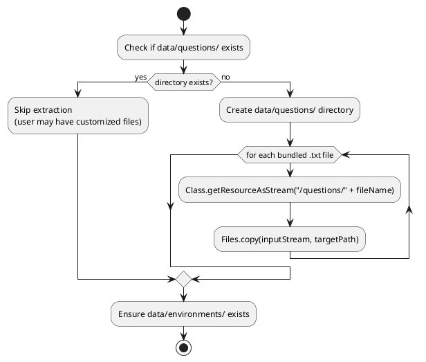

This design respects user customizations — once the questions directory exists, bundled resources are never overwritten.

---

## Appendix A: Product Scope

### Target User Profile

- Computer Science students learning Linux command-line basics.
- Prefer an interactive, hands-on approach over reading documentation.
- Comfortable typing commands in a terminal-like interface.
- Want a safe sandbox environment to practice Linux commands without affecting real systems.
- Desire immediate feedback on their Linux command knowledge through quizzes.

### Value Proposition

LinuxLingo provides an interactive Linux shell simulator combined with a quiz system, allowing students to:

- Practice Linux commands (navigation, file operations, text processing, permissions) in a safe virtual file system.
- Test their knowledge through multiple question types (MCQ, fill-in-the-blank, practical).
- Save and restore VFS environments for continued practice.
- Learn without needing access to a real Linux machine.

---

## Appendix B: User Stories

| Priority | As a … | I want to … | So that I can … |
| -------- | ------ | ----------- | --------------- |
| `***` | new user | see a help menu | learn what commands are available |
| `***` | student | practice basic navigation commands (cd, ls, pwd) | become familiar with Linux file system navigation |
| `***` | student | create and manipulate files and directories | learn file management in Linux |
| `***` | student | take an exam on a specific topic | test my knowledge of Linux commands |
| `***` | student | see my exam score after completing a quiz | know how well I understand the material |
| `**` | student | use piping to chain commands | understand how data flows between commands |
| `**` | student | use output redirection (>, >>) | learn how to save command output to files |
| `**` | student | save my VFS environment | continue practicing from where I left off |
| `**` | student | load a previously saved environment | restore my practice workspace |
| `**` | student | practice practical questions in a real shell | apply my knowledge hands-on |
| `**` | student | use text processing commands (grep, sort, wc) | learn data manipulation on the command line |
| `**` | student | change file permissions with chmod | understand Linux permission model |
| `*` | student | take a random question | get a quick knowledge check |
| `*` | student | list and delete saved environments | manage my saved workspaces |
| `*` | student | use conditional execution (&&) | understand command chaining logic |

---

## Appendix C: Non-Functional Requirements

1. **Portability:** Should work on any mainstream OS (Windows, Linux, macOS) with Java 17 or above installed.
2. **Performance:** All shell commands should execute in under 100ms. VFS operations should handle file systems with up to 1000 nodes without noticeable lag.
3. **Usability:** A user familiar with basic Linux commands should be able to use the shell simulator without consulting documentation.
4. **Reliability:** The application should handle all invalid inputs gracefully (no crashes) and provide descriptive error messages.
5. **Testability:** All components should be unit-testable in isolation. The `Ui` class accepts injectable I/O streams for test harness use.
6. **Data Integrity:** VFS snapshots saved to disk must be losslessly restorable. Escaping rules must preserve file content containing newlines, pipes, and backslashes.
7. **Single-user:** The application is designed for single-user use and does not need to handle concurrent access.

---

## Appendix D: Glossary

| Term | Definition |
| ---- | ---------- |
| **VFS** | Virtual File System — an in-memory tree structure simulating a Linux file system. No real files on disk are created or modified by shell commands. |
| **Shell Session** | An interactive REPL where users type Linux-like commands that operate on the VFS. |
| **Exam Session** | A quiz session where users answer questions about Linux commands. |
| **MCQ** | Multiple Choice Question — presents options A/B/C/D; user selects one. |
| **FITB** | Fill In The Blank — user types a free-form answer checked against accepted answers. |
| **PRAC** | Practical question — user performs tasks in a temporary shell; VFS state is verified against checkpoints. |
| **Checkpoint** | A path + expected node type (DIR or FILE) used to verify PRAC question answers. |
| **Segment** | A single command with its arguments and optional redirect info, part of a `ParsedPlan`. |
| **ParsedPlan** | The structured result of parsing a shell input: a list of Segments connected by operators. |
| **Environment (.env)** | A text file storing a serialized VFS snapshot and working directory, saved under `data/environments/`. |
| **Piping** | Connecting the stdout of one command to the stdin of the next using `\|`. |
| **Redirection** | Directing command output to a file using `>` (overwrite) or `>>` (append). |
| **Question Bank** | A collection of question files (`.txt`) organized by topic under `data/questions/`. |
| **Mainstream OS** | Windows, Linux, macOS. |

---

## Appendix E: Instructions for Manual Testing

> **Note:** These instructions provide a starting point for testers. Testers are expected to do more exploratory testing.

### Launch and Shutdown

1. **Initial launch**
   - Ensure Java 17+ is installed.
   - Build the project: `./gradlew shadowJar`
   - Run: `java -jar build/libs/tp.jar`
   - Expected: Welcome banner and `linuxlingo>` prompt are displayed.

2. **Help command**
   - Input: `help`
   - Expected: List of available top-level commands (shell, exam, exec, help, exit) is displayed.

3. **Exit**
   - Input: `exit`
   - Expected: Prints "Goodbye!" and application terminates.

### Shell Simulator

1. **Entering the shell**
   - Input: `shell`
   - Expected: Welcome message and shell prompt `user@linuxlingo:/$` are displayed.

2. **Basic navigation**
   - Input: `pwd`
   - Expected: `/`
   - Input: `cd /home/user`
   - Expected: Prompt changes to `user@linuxlingo:/home/user$`
   - Input: `cd -`
   - Expected: Returns to `/`, prints `/`.
   - Input: `cd ~`
   - Expected: Navigates to `/home/user`.

3. **File and directory operations**
   - Input: `mkdir testdir`
   - Expected: No output (success).
   - Input: `ls`
   - Expected: `testdir` appears in listing.
   - Input: `touch testdir/hello.txt`
   - Expected: No output (success).
   - Input: `echo "Hello World" > testdir/hello.txt`
   - Input: `cat testdir/hello.txt`
   - Expected: `Hello World`

4. **Piping**
   - Input: `echo "line1" | cat`
   - Expected: `line1`
   - Input: `echo "apple" | grep apple`
   - Expected: `apple`

5. **Redirection**
   - Input: `echo "test output" > /tmp/out.txt`
   - Input: `cat /tmp/out.txt`
   - Expected: `test output`
   - Input: `echo "more output" >> /tmp/out.txt`
   - Input: `cat /tmp/out.txt`
   - Expected: `test outputmore output`

6. **Conditional execution**
   - Input: `echo success && echo "also runs"`
   - Expected: Both `success` and `also runs` are printed.
   - Input: `ls /nonexistent && echo "should not run"`
   - Expected: Error message for `ls`, and `should not run` is NOT printed.

7. **Text processing**
   - Input: `echo "hello world" > /tmp/test.txt`
   - Input: `grep hello /tmp/test.txt`
   - Expected: `hello world`
   - Input: `wc /tmp/test.txt`
   - Expected: Line, word, and character counts.

8. **Permissions**
   - Input: `touch /tmp/secret.txt`
   - Input: `chmod 000 /tmp/secret.txt`
   - Input: `cat /tmp/secret.txt`
   - Expected: `Permission denied` error.

9. **Exiting the shell**
   - Input: `exit`
   - Expected: Returns to `linuxlingo>` prompt.

### Environment Management

1. **Save environment**
   - Enter shell, create some files/directories.
   - Input: `save myenv`
   - Expected: Environment saved message.
   - Input: `envlist`
   - Expected: `myenv` appears in the list.

2. **Load environment**
   - Input: `reset`
   - Expected: VFS is reset to default state.
   - Input: `load myenv`
   - Expected: Previously created files/directories are restored.

3. **Delete environment**
   - Input: `envdelete myenv`
   - Expected: Environment deleted message.
   - Input: `envlist`
   - Expected: `myenv` no longer appears.

### Exam Module

1. **Interactive exam**
   - Input (at main prompt): `exam`
   - Expected: List of topics is displayed with question counts.
   - Select a topic by number.
   - Enter number of questions (or press Enter for all).
   - Expected: Questions are presented one at a time with feedback after each.
   - Expected: Final score summary (e.g., `Score: 7/10 (70%)`).

2. **Direct exam with CLI args**
   - Input: `exam -t navigation -n 3`
   - Expected: 3 questions from the "navigation" topic.

3. **Random question**
   - Input: `exam -random`
   - Expected: One random question is presented.

4. **List topics**
   - Input: `exam -topics`
   - Expected: All available topics listed with question counts.

5. **PRAC question** (if available in question bank)
   - When a PRAC question appears, a temporary shell session opens.
   - Perform the required task (e.g., `mkdir /home/project`).
   - Type `exit` to submit.
   - Expected: Feedback on whether the VFS matches the expected state.

### One-Shot Execution

1. **Basic exec**
   - Input (at main prompt): `exec "echo hello"`
   - Expected: `hello` is printed.

2. **Exec with saved environment**
   - First save an environment in the shell (e.g., `save testenv`).
   - Input: `exec -e testenv "ls"`
   - Expected: Directory listing from the saved environment.

### Error Handling

1. **Unknown command in shell**
   - Input: `unknowncmd`
   - Expected: `unknowncmd: command not found`

2. **Invalid path**
   - Input: `cd /nonexistent/path`
   - Expected: `cd: No such file or directory: /nonexistent/path`

3. **Missing operand**
   - Input: `grep`
   - Expected: `grep: missing pattern`

4. **Invalid exam topic**
   - Input: `exam -t nonexistent`
   - Expected: `Invalid topic selection.` followed by available topics list.
